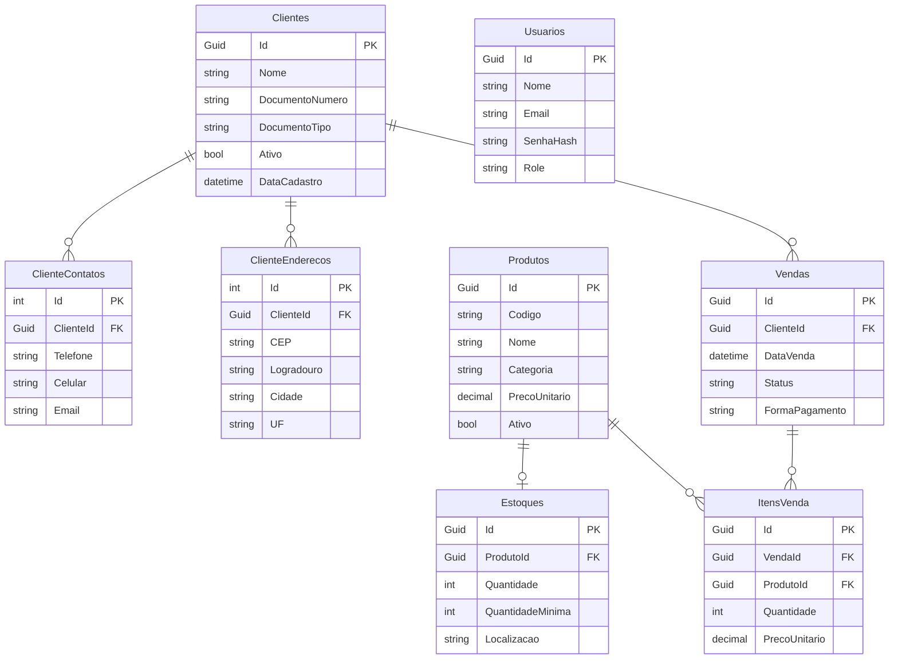

# NexSell — Sistema de Gestão de Vendas com Recomendações Inteligentes

API RESTful desenvolvida em .NET 8 para gestão comercial de pequenas e médias empresas, com módulo de recomendação de produtos baseado em inteligência artificial via [Recombee](https://www.recombee.com/).

> Trabalho de Conclusão de Curso — Engenharia de Software

**Deploy:** `https://nexsell.up.railway.app/api`  
**Documentação interativa:** `https://nexsell.up.railway.app/swagger`

---

## Sumário

- [Arquitetura](#arquitetura)
- [Módulos](#módulos)
- [Tecnologias](#tecnologias)
- [Estrutura do Projeto](#estrutura-do-projeto)
- [Como Executar Localmente](#como-executar-localmente)
- [Variáveis de Ambiente](#variáveis-de-ambiente)
- [Endpoints](#endpoints)
- [Modelo de Dados](#modelo-de-dados)
- [Testes](#testes)
- [Deploy](#deploy)

---

## Arquitetura

O sistema segue os princípios do **Domain-Driven Design (DDD)**, organizado em quatro camadas:

| Camada | Responsabilidade |
|---|---|
| **Domain** | Entidades, objetos de valor, interfaces de repositório e regras de negócio |
| **Application** | Serviços de aplicação, DTOs e orquestração de casos de uso |
| **Infrastructure** | EF Core, repositórios, Unit of Work e integração com Recombee |
| **API** | Controllers REST, middlewares, autenticação JWT e Swagger |

Os padrões **Repository** e **Unit of Work** abstraem o acesso a dados. As migrações são aplicadas automaticamente na inicialização, sem necessidade de scripts manuais.

---

## Módulos

| Módulo | Funcionalidades |
|---|---|
| **Autenticação** | Login com JWT, criação de usuários (Admin), token com validade de 8h |
| **Clientes** | CRUD com suporte a CPF/CNPJ, contatos e endereços múltiplos, ativação/inativação |
| **Produtos** | Cadastro por código e categoria, sincronização automática com Recombee |
| **Estoque** | Controle de quantidade, alertas de estoque mínimo, entradas e saídas |
| **Vendas** | Criação, adição/remoção de itens, confirmação com baixa automática de estoque, cancelamento com estorno |
| **Recomendações** | Sugestões personalizadas por cliente via Recombee (filtragem colaborativa e por conteúdo) |
| **Relatórios** | Vendas por período, ticket médio, produtos/clientes/categorias mais vendidos, posição de estoque |

### Integração com Recombee

O sistema interage com o Recombee em três momentos:

1. **Cadastro/atualização de produto** → `SetItemValues` (sincroniza nome, categoria e preço)
2. **Confirmação de venda** → `AddPurchase` por item (alimenta o modelo colaborativo)
3. **Consulta de recomendações** → retorna até N produtos ranqueados por cliente

Falhas na comunicação com o Recombee não bloqueiam operações do sistema central.

---

## Tecnologias

- **.NET 8** / ASP.NET Core Web API
- **Entity Framework Core 8** — SQLite (dev) / PostgreSQL (prod)
- **Recombee SDK v6.1.0** — recomendações com filtragem colaborativa
- **JWT Bearer** — autenticação stateless
- **Swagger / OpenAPI** — documentação interativa
- **xUnit + Moq** — testes unitários e de integração
- **Docker** — containerização para deploy
- **Railway** — hospedagem em produção

---

## Estrutura do Projeto

```
GerenciamentoDeVendas/
├── Domain/                  # Entidades, Value Objects, interfaces
├── Application/             # Serviços, DTOs, interfaces de serviço
├── Infrastructure/          # EF Core, repositórios, migrações
├── API/                     # Controllers, middlewares, Program.cs
├── Teste.Domain/            # 154 testes unitários de domínio
├── Teste.Application/       # 58 testes unitários de aplicação
├── Teste.Integration/       # Testes de integração com Recombee
├── Dockerfile
├── railway.toml
└── GerenciamentoDeVendas.sln
```

---

## Como Executar Localmente

**Pré-requisitos:** .NET 8 SDK

```bash
# Restaurar dependências e executar
dotnet run --project API/API.csproj
```

A API sobe em `https://localhost:5001` e o Swagger em `/swagger`.  
O banco SQLite é criado automaticamente com as migrações aplicadas na inicialização.  
Um usuário **Admin** padrão é criado na primeira execução.

---

## Variáveis de Ambiente

Configure em `appsettings.json` ou via variáveis de ambiente:

| Chave | Descrição |
|---|---|
| `ConnectionStrings__DefaultConnection` | String de conexão (SQLite ou PostgreSQL) |
| `Recombee__DatabaseId` | ID do banco Recombee |
| `Recombee__PrivateToken` | Token privado do Recombee |
| `Recombee__Region` | Região do Recombee (`us-west`) |
| `Jwt__Secret` | Chave secreta para assinar tokens JWT (mín. 32 caracteres) |
| `Jwt__ExpiracaoMinutos` | Validade do token em minutos (padrão: `480`) |

---

## Endpoints

Base URL: `https://nexsell.up.railway.app/api`

> Todos os endpoints exceto `POST /auth/login` exigem header `Authorization: Bearer {token}`.

### Auth

| Método | Rota | Descrição | Auth |
|---|---|---|---|
| POST | `/auth/login` | Autentica e retorna token JWT | Pública |
| POST | `/auth/usuarios` | Cria novo usuário | Admin |

### Clientes

| Método | Rota | Descrição |
|---|---|---|
| GET | `/clientes` | Lista todos os clientes |
| GET | `/clientes/{id}` | Busca cliente por ID |
| GET | `/clientes/ativos` | Lista clientes ativos |
| GET | `/clientes/buscar?nome=` | Busca clientes por nome |
| GET | `/clientes/documento/{documento}` | Busca por CPF/CNPJ |
| POST | `/clientes` | Cria novo cliente |
| PUT | `/clientes/{id}` | Atualiza cliente |
| PATCH | `/clientes/{id}/ativar` | Ativa cliente |
| PATCH | `/clientes/{id}/inativar` | Inativa cliente |
| POST | `/clientes/{id}/contatos` | Adiciona contato secundário |
| POST | `/clientes/{id}/enderecos` | Adiciona endereço secundário |

### Produtos

| Método | Rota | Descrição |
|---|---|---|
| GET | `/produtos` | Lista todos os produtos |
| GET | `/produtos/{id}` | Busca produto por ID |
| GET | `/produtos/ativos` | Lista produtos ativos |
| GET | `/produtos/buscar?nome=` | Busca por nome |
| GET | `/produtos/codigo/{codigo}` | Busca por código interno |
| GET | `/produtos/categoria/{categoria}` | Lista por categoria |
| POST | `/produtos` | Cria novo produto |
| PUT | `/produtos/{id}` | Atualiza produto |
| PATCH | `/produtos/{id}/ativar` | Ativa produto |
| PATCH | `/produtos/{id}/inativar` | Inativa produto |
| PATCH | `/produtos/{id}/estoque/adicionar` | Adiciona quantidade ao estoque |
| PATCH | `/produtos/{id}/estoque/remover` | Remove quantidade do estoque |

### Estoque

| Método | Rota | Descrição |
|---|---|---|
| GET | `/estoque` | Lista todos os registros de estoque |
| GET | `/estoque/{id}` | Busca estoque por ID |
| GET | `/estoque/produto/{produtoId}` | Estoque de um produto |
| GET | `/estoque/baixo` | Produtos abaixo do estoque mínimo |
| GET | `/estoque/disponivel/{produtoId}/{quantidade}` | Verifica disponibilidade |
| POST | `/estoque` | Cria registro de estoque |
| PUT | `/estoque/{id}` | Atualiza quantidade mínima e localização |
| POST | `/estoque/entrada` | Registra entrada de mercadoria |
| POST | `/estoque/saida` | Registra saída de mercadoria |

### Vendas

| Método | Rota | Descrição |
|---|---|---|
| GET | `/vendas` | Lista todas as vendas |
| GET | `/vendas/{id}` | Busca venda por ID |
| GET | `/vendas/cliente/{clienteId}` | Vendas de um cliente |
| GET | `/vendas/status/{status}` | Filtra por status |
| GET | `/vendas/periodo?dataInicio=&dataFim=` | Filtra por período |
| GET | `/vendas/total` | Total de vendas |
| POST | `/vendas` | Cria nova venda |
| POST | `/vendas/{id}/confirmar` | Confirma venda e baixa estoque |
| POST | `/vendas/{id}/cancelar` | Cancela venda |
| POST | `/vendas/{id}/itens` | Adiciona item à venda |
| DELETE | `/vendas/{id}/itens/{itemId}` | Remove item da venda |
| PATCH | `/vendas/{id}/itens/{itemId}/quantidade` | Altera quantidade de item |

### Recomendações

| Método | Rota | Descrição |
|---|---|---|
| GET | `/recomendacoes/cliente/{clienteId}?quantidade=` | Recomendações para um cliente |
| GET | `/recomendacoes/cliente/{clienteId}/completo?quantidade=` | Cliente + recomendações |
| GET | `/recomendacoes/todos?quantidade=` | Todos os clientes com recomendações |

### Relatórios

| Método | Rota | Descrição |
|---|---|---|
| GET | `/relatorios/vendas/total-pedidos` | Total de pedidos |
| GET | `/relatorios/vendas/valor-total` | Valor total vendido |
| GET | `/relatorios/vendas/ticket-medio` | Ticket médio |
| GET | `/relatorios/vendas/por-produto` | Produtos mais vendidos |
| GET | `/relatorios/vendas/por-cliente` | Clientes que mais compraram |
| GET | `/relatorios/vendas/por-categoria` | Categorias mais vendidas |
| GET | `/relatorios/estoque` | Posição atual do estoque com alertas |

> Os endpoints de relatório aceitam os parâmetros opcionais `?dataInicio={data}&dataFim={data}`.

### Enums

**FormaPagamento:** `Dinheiro` · `CartaoCredito` · `CartaoDebito` · `Pix` · `Boleto` · `Transferencia`

**StatusVenda:** `Pendente` · `Confirmada` · `Cancelada`

---

## Modelo de Dados



---

## Testes

### Testes Unitários de Domínio — `Teste.Domain`

154 testes cobrindo todas as entidades e objetos de valor:

```bash
dotnet test Teste.Domain/
```

### Testes Unitários de Aplicação — `Teste.Application`

58 testes dos serviços de aplicação com Moq:

| Serviço | Testes |
|---|---|
| ClienteService | 11 |
| ProdutoService | 11 |
| EstoqueService | 14 |
| VendaService | 17 |
| RecomendacaoService | 5 |
| **Total** | **58** |

```bash
dotnet test Teste.Application/
```

### Testes de Integração — `Teste.Integration`

Validação do módulo de recomendações com 55 cenários reais contra a API do Recombee:

- 50 produtos sintéticos em 5 categorias
- 5 perfis de cliente × 11 instâncias cada
- Métricas: **Precision@5** e **Recall@5** (K = 5)

| Perfil | Precision@5 | Recall@5 |
|---|---|---|
| Esportista | 34,5% | 86,4% |
| Leitor | 34,5% | 86,4% |
| Gamer | 12,7% | 31,8% |
| HomeOffice | 7,3% | 18,2% |
| Programador | 7,3% | 18,2% |
| **Média** | **19,3%** | **48,2%** |

Limiares mínimos definidos: Precision@5 ≥ 5% e Recall@5 ≥ 10% — todos os 55 cenários aprovados.

```bash
dotnet test Teste.Integration/
```

> Os testes de integração requerem acesso à API do Recombee configurada em `appsettings.json`.

---

## Deploy

A aplicação é containerizada com Docker e hospedada no Railway.

```dockerfile
FROM mcr.microsoft.com/dotnet/sdk:8.0 AS build
WORKDIR /src
COPY . .
RUN dotnet publish API/API.csproj -c Release -o /app/publish

FROM mcr.microsoft.com/dotnet/aspnet:8.0
WORKDIR /app
COPY --from=build /app/publish .
CMD dotnet API.dll
```

Em produção, o banco de dados é PostgreSQL. A string de conexão é configurada via variável de ambiente na plataforma Railway.
